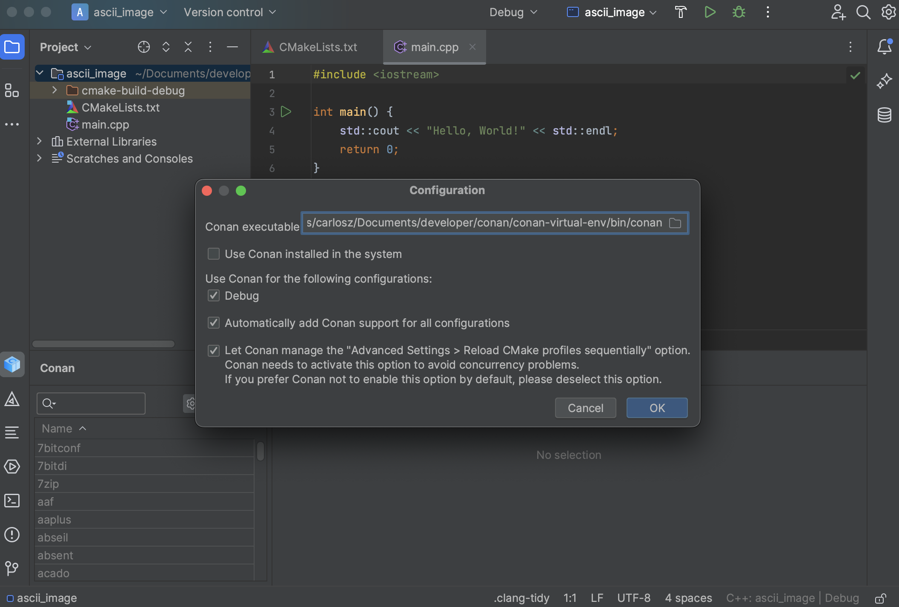

# Conan CLion plugin

<!-- Next tags are used by the build workflow to generate the description, don't remove -->

<!-- Plugin description -->
Conan, the C and C++ package manager, now directly in your IDE.
List available libraries, install and use them without leaving CLion

<!-- Plugin description end -->

## Using the Plugin

> **Note**
> 
> For a detailed explanation of how to use the plugin check: https://blog.conan.io/introducing-new-conan-clion-plugin/

Go to the “Conan” tool tab at the bottom of the IDE. You will see that the only enabled
action in the toolbar of the plugin is the one with the ⚙️ (wheel) symbol, click on it. 

The first thing you should do there is configuring the Conan client executable that's
going to be used. You can point to one specifically installed in an arbitrary location on
your system or you can select *"Use Conan installed in the system"* to use the one
installed at the system level.

You will find there some options marked as default. Normally, if you are using the Conan plugin, you wouldn't want to unmark them. So leave
them and let's create our project and add the libraries to it. So, click on the OK button
and the plugin should be ready to use.

After doing the initial configuration, you will notice that the list of libraries is now
enabled and that the 🔄 (update) and 👁️ (inspect) symbols are also enabled.

Now that we have our plugin configured and ready, you can now search for any libraries available in Conan Center and add those to your project.

Now, if you click on the 👁️ (inspect) icon mentioned earlier, you will see all the
libraries we added to the project. This includes basic target information for CMake and
the necessary code snippets to add to CMake to use them.

## Installation

- Using IDE built-in plugin system:
  
  <kbd>Settings/Preferences</kbd> > <kbd>Plugins</kbd> > <kbd>Marketplace</kbd> > <kbd>Search for "Conan"</kbd> >
  <kbd>Install Plugin</kbd>
  
- Manually:

  Download the [latest release](https://github.com/conan-io/conan-clion-plugin/releases/latest) and install it manually using
  <kbd>Settings/Preferences</kbd> > <kbd>Plugins</kbd> > <kbd>⚙️</kbd> > <kbd>Install plugin from disk...</kbd>

---
Plugin based on the [IntelliJ Platform Plugin Template][template].

[template]: https://github.com/JetBrains/intellij-platform-plugin-template
[docs:plugin-description]: https://plugins.jetbrains.com/docs/intellij/plugin-user-experience.html#plugin-description-and-presentation
